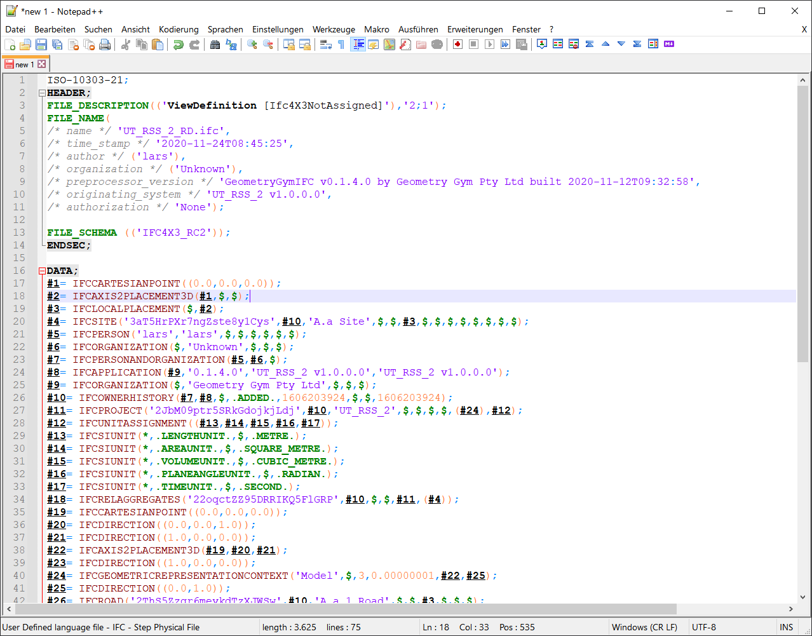

# npplusplus-udl-ifc
**User defined language for IFC step physical files for text editor Notepad++**

# Purpose
[Notepad++](https://github.com/notepad-plus-plus/notepad-plus-plus) is a great text editor. It supports custom syntax highlighting ([UDL](https://github.com/notepad-plus-plus/userDefinedLanguages/), user defined language). Because there was no support for `.ifc` or `.spf` files I created my own UDL. It is optimized for IFC. Other STEP files may not work.

# Examples

## Office building from Karlsruhe Institute of Technology (KIT)
Download `.ifc` file: [KIT IFC Examples from IfcWiki](https://www.ifcwiki.org/index.php?title=KIT_IFC_Examples)

Syntax highlighting in np++:

Just as reference: this is how this building looks in a CAD programm:  

## Spatial structure from building smart
Download `.ifc` file: [Spatial Strcture 3](https://github.com/buildingSMART/Sample-Test-Files/tree/master/IFC%204.3/SpatialStructure_3)

Syntax highlighting in np++:

# Known issues
- Square brackets inside quotation marks are highlighted as delimiter but should be just text instead (see line 3 in KIT example screenshot)
- Most `.ifc` files are quite large. Files with more than ~ 10 Megabyte make np++ really slow with syntax highlighting. If you want to load larger files maybe disable syntax highlighting for `.ifc` first or rename the file before opening it.

# Additional Information
The Industry Foundation Classes or short [IFC](https://technical.buildingsmart.org/standards/ifc/) is a data model intended to describe architectural, building and construction industry data. One way to exchange these data models is the [STEP Physical File format for IFC](http://www.steptools.com/stds/ifc/) which is a structured text file. It is defined by [ISO 10303-21:2016](https://www.iso.org/standard/63141.html) which is unfortunately non-free. Some basic syntax can be found [here](https://www.loc.gov/preservation/digital/formats/fdd/fdd000448.shtml) and [here](http://www.steptools.com/stds/step/p21e3_final_review.pptx).
